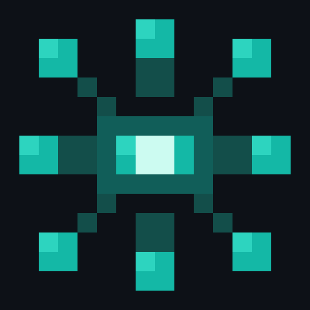

<p align="center">
  
</p>

# simaris

Knowledge management CLI with SQLite, hybrid (vector + text) retrieval, and graph-based linking.

## Overview

Simaris stores typed knowledge units in a local SQLite database with hybrid retrieval (lance KNN + tantivy + FTS5 fused via RRF), graph-based relationships between units, confidence scoring via feedback marks, and corpus-hygiene tooling (`similar`, `cluster`, `lint`, `dream`, `vacuum`). Built for LLM agents and developers who need structured, searchable knowledge that evolves over time.

## Installation

### Homebrew

```bash
brew install simonspoon/tap/simaris
```

### Cargo

```bash
cargo install --git https://github.com/simonspoon/simaris.git
```

### From Source

```bash
git clone https://github.com/simonspoon/simaris.git
cd simaris
cargo build --release
# Binary at ./target/release/simaris
```

## Quick Start

```bash
# Add a typed knowledge unit
simaris add "Rust edition 2024 requires cargo 1.85+" --type fact --tags "rust,toolchain"

# Search by content
simaris search "rust edition"

# Link related units
simaris link <id-1> <id-2> --rel related_to

# Record feedback (adjusts confidence)
simaris mark <id> --kind helpful

# Ask a question (FTS5 + 1-hop graph expansion)
simaris ask "What do I know about Rust editions?"
```

## Commands

| Command | Description |
|---------|-------------|
| `add <content> --type <type>` | Create a typed knowledge unit |
| `show <id>` | Display a unit with its links |
| `edit <id> [--content] [--type] [--source] [--tags]` | Update an existing unit |
| `link <from> <to> --rel <relationship>` | Create a graph edge between units |
| `drop <content>` | Capture raw input to the inbox |
| `promote <id> --type <type>` | Convert an inbox item to a typed unit |
| `inbox` | List pending inbox items |
| `list [--type <type>] [--include-archived]` | List knowledge units |
| `search <query> [--type <type>] [--no-vec] [--top-k <n>] [--scores] [--include-archived]` | Hybrid retrieval (lance KNN + tantivy + RRF); `--no-vec` forces FTS5-only |
| `similar <id> [--top-k <n>] [--threshold <f>] [--no-vec]` | Rank near-duplicates of a unit (`α·vec_sim + β·tag_overlap + γ·type_match`) |
| `cluster [--tag <tag> \| --all] [--type <y>] [--min-cluster-size <n>] [--threshold <f>]` | Store-wide redundancy survey with pattern annotation |
| `ask <query> [--type <type>] [--include-archived]` | Query store; FTS5 + 1-hop graph expansion |
| `prime <task> [--filter <strategy>] [--primary <id\|slug>]...` | Assemble a task-focused mindset grouped by unit type |
| `stats [--top <n>] [--include-archived]` | Aggregate metrics for the admin dashboard |
| `archive <id>` | Soft-delete a unit (reversible via `unarchive`) |
| `unarchive <id>` | Restore an archived unit |
| `clone <id> [--type] [--source] [--tags]` | Copy a unit into a fresh UUIDv7 |
| `mark <id> --kind <kind>` | Record feedback on a unit |
| `delete <id>` | Delete a knowledge unit |
| `slug set\|unset\|list` | Manage human-readable slugs that resolve to unit IDs |
| `emit --target <target> --type <type>` | Emit typed units as build artifacts |
| `rewrite <id> [--template-only]` | Edit a unit in `$EDITOR` with a type-aware skeleton |
| `scan [--stale-days <days>]` | Find low-confidence, stale, or orphaned units |
| `lint [--fix-suggest] [--by-aspect] [--snapshot] [--history \| --ci]` | Read-only rot audit with optional snapshot history and CI regression check |
| `vec backfill [--model bge-m3] [--reembed-with-context]` | (Re)build the lance + tantivy vector index from `units` (requires Ollama) |
| `context-enhance [--dry-run \| --execute] [--limit <n>]` | Generate Anthropic-style preambles into `units.context_preamble` (Haiku 3.5) |
| `dream decay [--dry-run] [--half-life-days <n>]` | Ebbinghaus confidence decay + auto-archive below 0.1 (excludes slug-pinned + `part_of`) |
| `vacuum autolink [--apply] [--limit <n>]` | Prune low-signal auto-link edges |
| `backup` | Create a database backup |
| `restore [<filename>]` | Restore from backup (no args = list backups) |

### Global Flags

- `--json` -- Machine-readable JSON output on all commands
- `--debug` -- Trace internal processing (used with `ask`)

## Knowledge Types

| Type | Description |
|------|-------------|
| `fact` | Verified information or data point |
| `procedure` | Step-by-step process or method |
| `principle` | Guiding rule or design philosophy |
| `preference` | Personal choice or configuration |
| `lesson` | Insight learned from experience |
| `idea` | Speculative concept or proposal |
| `aspect` | Facet or dimension of a broader topic |

## Relationships

| Relationship | Description |
|--------------|-------------|
| `related_to` | General association between units |
| `part_of` | Unit is a component of another |
| `depends_on` | Unit requires another to be valid |
| `contradicts` | Units present conflicting information |
| `supersedes` | Unit replaces an older unit |
| `sourced_from` | Unit was derived from another |

## Marks

| Kind | Confidence Delta |
|------|-----------------|
| `used` | +0.05 |
| `helpful` | +0.10 |
| `outdated` | -0.10 |
| `wrong` | -0.20 |

## Environment Variables

| Variable | Purpose | Default |
|----------|---------|---------|
| `SIMARIS_HOME` | Override data directory | `~/.simaris/` |
| `SIMARIS_ENV=dev` | Isolate to dev database | `~/.simaris/dev/sanctuary.db` |
| `SIMARIS_SIM_ALPHA` / `_BETA` / `_GAMMA` | `similar` scoring weights (`α·vec_sim + β·tag_overlap + γ·type_match`) | `0.6 / 0.3 / 0.1` |
| `SIMARIS_OLLAMA_URL` | Ollama base URL for `vec backfill` embeddings | `http://localhost:11434` |
| `ANTHROPIC_API_KEY` | Required by `context-enhance` for Haiku 3.5 preamble generation | — |
| `SIMARIS_RATE_LIMIT_RPM` | Rate limit for `context-enhance` Anthropic calls | `50` |

Data lives at `~/.simaris/sanctuary.db`. Vector indexes live at `~/.simaris/vec/<model>/` (lance dataset + tantivy subdir).

### External Dependencies

- SQLite is bundled via rusqlite — no system SQLite required.
- Lance + tantivy are built into the binary.
- Ollama on `localhost:11434` running `bge-m3` — only needed when running `vec backfill`.
- Anthropic API (Haiku 3.5) — only needed when running `context-enhance --execute`.

## Architecture

```
src/main.rs         CLI entry, clap derive command parsing, dispatch (also hosts vec/vacuum)
src/db.rs           SQLite schema, migrations, CRUD, backup/restore, scan
src/ask.rs          FTS5 search + 1-hop graph expansion (`ask`, `prime`)
src/hybrid.rs       Hybrid retrieval: lance KNN + tantivy + RRF fusion (`search` default path)
src/similar.rs      `similar` primitive — α·vec_sim + β·tag_overlap + γ·type_match
src/cluster.rs      Store-wide redundancy survey + pattern annotation + union-find
src/context.rs      `context-enhance` — Anthropic preamble generation via Haiku 3.5
src/dream.rs        `dream decay` — Ebbinghaus confidence decay + auto-archive
src/lint.rs         Read-only rot audit, snapshot history, CI regression check
src/display.rs      Text and JSON output formatting
src/emit.rs         Build-artifact emission (claude-code aspects, etc.)
src/rewrite.rs      $EDITOR rewrite flow with type-aware skeletons
src/frontmatter.rs  YAML frontmatter parse/write + refs: graph materialization
src/size_guard.rs   Write-time body-size thresholds + warnings
tests/integration.rs  End-to-end CLI tests via subprocess
simaris-server/     Axum HTTP admin dashboard (separate workspace member)
web/                Static dashboard + units page (vanilla JS + ECharts)
```

### Schema

- **units** -- UUIDv7 primary key, content, type, source, confidence, verified, archived, tags (JSON), `context_preamble` (nullable), timestamps
- **links** -- Composite key (from_id, to_id, relationship), CASCADE delete
- **inbox** -- UUIDv7 primary key, content, source, timestamp
- **marks** -- UUIDv7 primary key, unit_id FK, kind, timestamp
- **slugs** -- TEXT primary key, unit_id FK, CASCADE delete
- **lint_snapshots** -- persisted `lint` totals for delta/CI mode
- **embedding_cache** -- cached embedding vectors keyed by content hash
- **units_fts** -- FTS5 virtual table synced via triggers

Vector indexes live outside SQLite at `~/.simaris/vec/<model>/` (lance dataset + tantivy subdir).

Default views (`list`, `search`, `ask`, `prime`, `scan`, `emit`, `similar`, `cluster`) hide archived units. Pass `--include-archived` to fold them back in.

## Admin Dashboard (simaris-server)

`simaris-server` is an HTTP admin UI for the knowledge store. It binds `0.0.0.0:3535`, mounts a JSON API under `/api`, and serves a static SPA from `web/`. All data and mutations shell out to the `simaris` CLI — no direct SQLite access. See [docs/simaris-server.md](docs/simaris-server.md) for launchd setup on macOS.

```bash
cargo install --path ./simaris-server
simaris-server   # http://localhost:3535
```

## License

[MIT](LICENSE)
